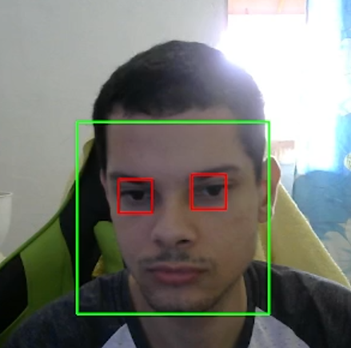
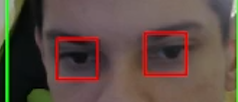

# Visao_computacional

## Estudos e teste de implementações de algoritmos de visão computacional

## Algoritmo de Haar Cascade

- O algoritmo de Haar Cascade é um algoritmo de aprendizado de máquina utilizado para detecção de objetos em imagens ou vídeos, ele foi desenvolvido por Paul Viola e Michael Jones em 2001 e é um dos algoritmos mais utilizados para detecção de objetos em imagens e vídeos.

### 1. Detecção de rosto

- Utilizando o algoritmo de Haar Cascade para detecção de rostos em imagens e vídeos.

- Usamos um arquivo XML com os dados de treinamento do algoritmo de Haar Cascade para detecção de rostos.

- Algoritmo de Haar Cascade: https://docs.opencv.org/3.4/db/d28/tutorial_cascade_classifier.html

### 2. Detecção de olhos

- Utilizando o algoritmo de Haar Cascade para detecção de olhos em imagens e vídeos.

- Usamos um arquivo XML com os dados de treinamento do algoritmo de Haar Cascade para detecção de olhos.

